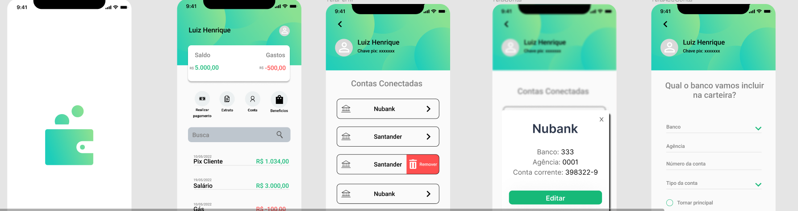

<h1 align="center">
  App-Financas
</h1>

<p>
  


  <a href="https://github.com/Lu1sHenrique/AppFinancas/commits/main">
    
  </a>
  
  
<p align="center">
  <a href="#-Tecnologias">Tecnologias</a>&nbsp;&nbsp;&nbsp;|&nbsp;&nbsp;&nbsp;
  <a href="#-projeto">Projeto</a>&nbsp;&nbsp;&nbsp;|&nbsp;&nbsp;&nbsp;
  <a href="#-layout">Layout</a>&nbsp;&nbsp;&nbsp;|&nbsp;&nbsp;&nbsp;
  <a href="#-Licença">Licença</a>
</p>

</p>


> Status do Projeto: ⚠️  (desenvolvimento)


## 💻 Sobre o projeto
Esse é um projeto que realiza o gerenciamento de contas bancarias e afins.

## ⚙️ Funcionalidades

- [x] Transições
- [ ]

## 🛠 Tecnologias

As seguintes ferramentas foram usadas na construção do projeto:

-   Java
-   JavaScript
-   Docker
-   Maven

## 🔖 Layout
<p align="center">
  
</p>

Você pode visualizar o layout completo do projeto através [desse link](https://www.figma.com/file/G0nXHnyD2OPGkpfkRSc0Do/App-Fin?node-id=0%3A1).  É necessário ter conta no [Figma](http://figma.com/) para acessá-lo.s

## Tarefas 

-   [X] Criação de Estrutura
-   [X] Add  layout
-   [X] Criação de API
-   [X] conexao com o banco 🧮 
-   [ ] Tratamento de Erros
-   [ ] 

### ✔️ Pré-requisitos

Antes de começar, você vai precisar ter instalado em sua máquina as seguintes ferramentas:
[Git](https://git-scm.com). 
Além disto é bom ter um editor para trabalhar com o código como [VSCode](https://code.visualstudio.com/)

### :arrow_forward: Rodando 

```bash

# Clone este repositório
$ git clone git@github.com:Lu1sHenrique/AppFinancas.git

# Acesse a pasta do projeto no terminal/cmd
$ cd AppFinancas

# Instale as dependências
$ npm install

# Execute a aplicação em modo de desenvolvimento
$ npm run dev:server

```
## 💪 Como contribuir no projeto

1. Faça um **fork** do projeto.
2. Crie uma nova branch com as suas alterações: `git checkout -b my-feature`
3. Salve as alterações e crie uma mensagem de commit contando o que você fez: `git commit -m "feature: My new feature"`
4. Envie as suas alterações: `git push origin my-feature`
> Caso tenha alguma dúvida confira este [guia de como contribuir no GitHub](./CONTRIBUTING.md)

## 📝 Licença

Este projeto esta sobe a licença [xxxx]

## :handshake: Colaboradores
---

[ <br> <sub>Henrique</sub>](https://www.linkedin.com/in/luis-henriqueft/) | [ <br> <sub>Wander </sub>](https://www.linkedin.com/in/wander-rodrigues-9469831bb/) |  [ <br> <sub>Elbert</sub>](https://www.linkedin.com/in/elbert-ribeiro/)
| :---: | :---: | :---: | 

